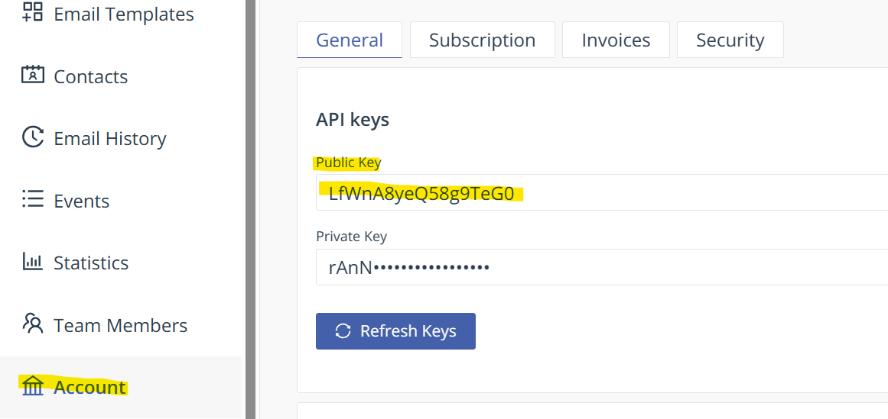
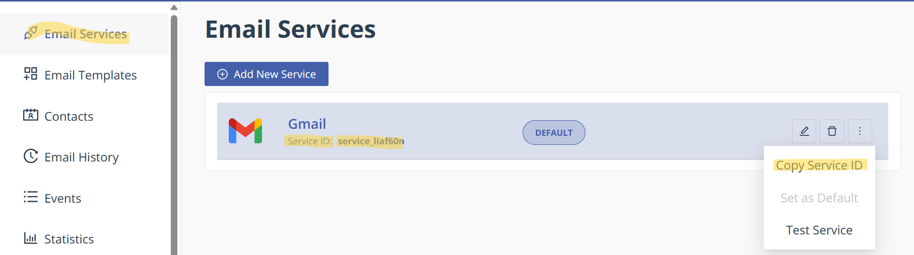
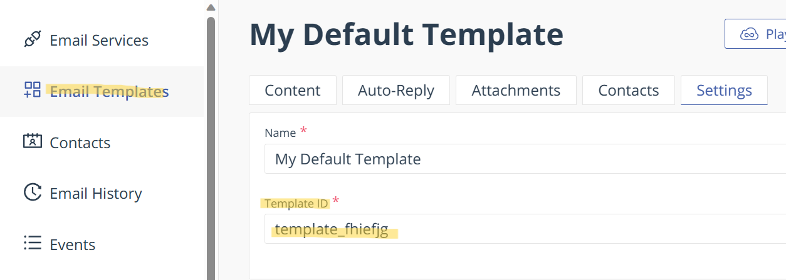

## Create a 3D Portfolio Website With React
### This project uses many react libraries
## Tips for Github Deployers
### If you want to deploy this site on github-pages, first create a Empty(important) repository in github and clone it on your system and start your project in that cloned repository folder, this can do after create project but it will become hard after create project because you need to copy all file,folder to this repository and the node_modules folder is very big, although Due to push into github there have no problem because of .gitignore file github will ignore the node_modules but development,build the site node_modules is needed this is a type of compiler for React
<br/>

### Read React Docs <a href="https://react.dev/blog/2023/03/16/introducing-react-dev" target="_blank">  </a>


### For Style we use:
### Tailwind CSS  <a href="https://tailwindcss.com/docs/guides/create-react-app" target="_blank">  </a>

### React Three Fiber
### Library for ThreeJS in React: <a href="https://docs.pmnd.rs/react-three-fiber/getting-started/introduction" target="_blank">  </a>
### For Animation in react 
### Framer Motion: <a href="https://www.npmjs.com/package/framer-motion" target="_blank">  </a>

### For Email Service
### EmailJS:<a href="https://www.emailjs.com/docs/examples/reactjs/" target="_blank">  </a>
<br/>

## Install all Dependencies in React
### For Create a React template using Vite Run this command in terminal
```
npm create vite@latest ./ -- --template react
```
### install Tailwind CSS and Initialize
```
npm install -D tailwindcss
npx tailwindcss init
```
### Install all Dependencies with a flag Like react-three,maath,react-tilt,emailjs,framer-motion and some others.
```
npm install --legacy-peer-deps @react-three/fiber @react-three/drei maath react-tilt react-vertical-component @emailjs/browser framer-motion react-router-dom
```
### For proper working of tailwindcss install postcss config
```
npm install -D tailwindcss postcss autoprefixer
```
### We need to install Original ThreeJS package to work properly react/three-fiber
```
npm install --legacy-peer-deps three
```
### After install all Dependencies start a developer server
```
npm run dev
```
### Use of EmailJS
### create a emailJS account and chose your service as gmail or else




### Never share your your private key, no problem with others because you can delete it any time but private key is private if share those ids what i share, any one can use that there have nothing just those massage will come into my mail i need to just disable or delete those service and ids thats it.

```jsx
const handleSubmit = (e) => {
    e.preventDefault();
    setLoading(true);
    emailjs.send('your service_ID in emailJS',
     'your templte_id',
     {
        //this from_name,from_massage,from_email is coming from your emailJS template
        from_name: form.name,
        from_message: form.message,
        from_email: form.email,
        // to_name:form.myname,

     },
     'your Public Key'
     )
}
```
### This is format of emailJS template for above code
```email
subject:-
New message from emailJS, React portfolio
content:-
Hello your name,

You got a new message from {{{from_name}}},

{{{from_email}}}

{{{from_message}}}
``` 
### you can add attribute as much as you want in {{{to_name}}}

<br/>

## For deploy your React vite App
### You can go through the Vite Deploy Static site Docs [https://vitejs.dev/guide/static-deploy.html]
### Or simply follow these steps
<br/>

### Go to vite.config.js and set base: "/your repository name/" just like this
```js
import { defineConfig } from 'vite'
import react from '@vitejs/plugin-react-swc'

// https://vitejs.dev/config/
export default defineConfig({
  plugins: [react()],
  base: "/animesh3Dportfolio/"
})
```
### Create a new folder .github\workflows\deploy.yml
### In your deploy.yml file copy paste the below code  
```yml
# Simple workflow for deploying static content to GitHub Pages
name: Deploy static content to Pages

on:
  # Runs on pushes targeting the default branch
  push:
    branches: ['main']

  # Allows you to run this workflow manually from the Actions tab
  workflow_dispatch:

# Sets the GITHUB_TOKEN permissions to allow deployment to GitHub Pages
permissions:
  contents: read
  pages: write
  id-token: write

# Allow one concurrent deployment
concurrency:
  group: 'pages'
  cancel-in-progress: true

jobs:
  # Single deploy job since we're just deploying
  deploy:
    environment:
      name: github-pages
      url: ${{ steps.deployment.outputs.page_url }}
    runs-on: ubuntu-latest
    steps:
      - name: Checkout
        uses: actions/checkout@v3
      - name: Set up Node
        uses: actions/setup-node@v3
        with:
          node-version: 18
          cache: 'npm'
      - name: Install dependencies
        run: npm install
      - name: Build
        run: npm run build
      - name: Setup Pages
        uses: actions/configure-pages@v3
      - name: Upload artifact
        uses: actions/upload-pages-artifact@v1
        with:
          # Upload dist repository
          path: './dist'
      - name: Deploy to GitHub Pages
        id: deployment
        uses: actions/deploy-pages@v1
```
### And change branches to your repository branch for my case it is master may be you have main or something else
```yml 
 branches: ['your branch']
```
<br/>

### Extra modification like add another section in portfolio
### you need to go this path:
* \src\components\ and create nameOfSection.jsx
* same path have a index.js import that .jsx file and export it as others
* in app.jsx import that and return that \<nameOfSection/> selfClosing tag
* then edit that .jsx file

# Happy Learning

### preview of this page [Link](https://animeshmaiti.github.io/animesh3Dportfolio/)


